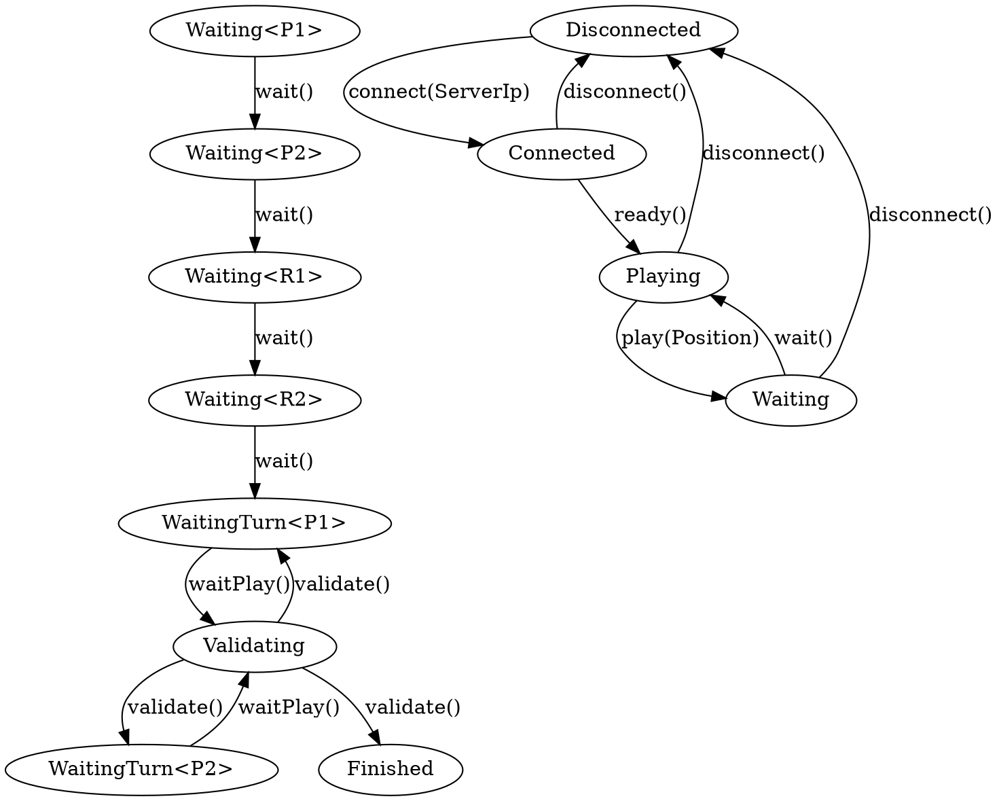

# Typestate Modelling

## Tic-Tac-Toe FSM

Sample Tic-Tac-Toe game in a client-server architecture:

Problems in the above graph:

- [🤔] Waiting is generic over the *waitee*.
- [😩] The `Validating` yields several possible results from a single call.
- [😉] The client-server interaction is not modelled.

Labels:

- [🤔] - No clue how to handle it.
- [😩] - Possible to handle but not ideal.
- [😉] - A bit of work should fix it.