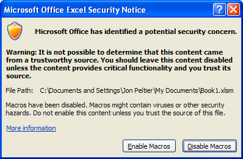

# Rust Macros - An Overview
This post is related to my ongoing work with Rust macros',
in it, I go through the Rust Reference and summarize the existing kinds of macros.

## What is a macro?

Before we start with Rust, we ought to define what a macro is.
Many of readers will remember the [Visual Basic Macros](https://docs.microsoft.com/en-us/office/vba/library-reference/concepts/getting-started-with-vba-in-office#macros-and-the-visual-basic-editor)
which allowed the user to automate repetitive tasks, they were mostly used in Excel,
from which readers will probably recognize the following dialog.



For more programming oriented folks macros will bring up distinct memories,
for some the dreaded unhygienic C macros, also known as parameterized macros
(or as I like to call them, "copy-paste with parameters"),
for others, macros invoke Lisp, the forefather of hygienic macros (and, according to XKCD, language of the universe).


Well, enough of blabbering, I'll just go on,
macros are rules or patterns which when applied to an input,
they produce an output to replace the input with.

As a quick example, consider the following pseudo-code definition of two macros `A` and `B`.

```
macro A => this_long_string_of_characters
macro B(p1, p2) => for x in range (p1, p2) {x + (p2 - p1)}
```

Wherever used, macro `A` will be replaced with `this_long_string_of_characters`,
similarly macro `B` will be replaced by the `for` loop, however it takes two parameters,
these will be present in the final output:

```
B(0, 5)
// will be replaced by
for x in range (0, 5) {x + (5-0)}
```

### Macro Hygiene

One last detail we need to address before diving in the reference is macro hygiene.
Macro hygiene is the concept behind macros which should work under any context,
that is, they are not affected or affect their surrounding environment.

